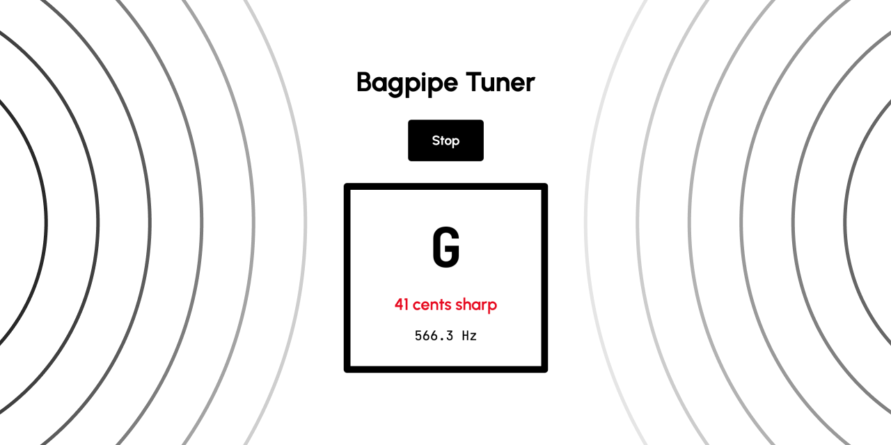

# Bagpipe Tuner

Live pitch tuner for the Highland bagpipes with drone filtering.

- YIN algorithm pitch detection through the device microphone
- High-pass drone filtering to isolate the chanter
- Median smoothing and octave-error correction for a steady reading
- Note matching on the bagpipe scale with a displayed sharp or flat reading
